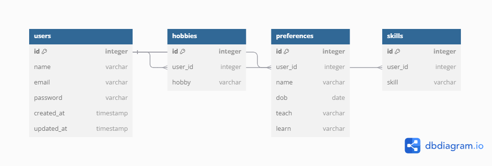

# Auth Service API Routes Documentation

This document outlines the available routes in the **Auth Service** of the microservices-based application. The service handles user registration, login, and logout functionalities. 

## Base Route

- **Base URL**: `/api/v1/auth`

## Routes

### Authentication Routes

- **`POST /register`**
  - Description: Registers a new user with an email and password.
  - Request Body:
    ```json
    {
      "name": "username",
      "email": "user@example.com",
      "password": "securePassword"
    }
    ```
  - Response:
    - Success: `201 Created`
    - Error: `400 Bad Request` if email already exists or password is invalid.

- **`POST /login`**
  - Description: Authenticates a user and generates a JWT token valid for 2 minutes.
  - Request Body:
    ```json
    {
      "email": "user@example.com",
      "password": "securePassword"
    }
    ```
  - Response:
    - Success: `200 OK` with JWT token
    - Error: `401 Unauthorized` if the email or password is incorrect.

- **`POST /logout`**
  - Description: Logs out the user and invalidates their session.
  - Request Body:
    ```json
    {
      "token": "JWT_Token_Here"
    }
    ```
  - Response:
    - Success: `200 OK` indicating the user is logged out.

---

## Database Schema

Below is the database schema for the Play Service:



# Environment Variables Setup

To run this **Auth Service**, you need to create a `.env` file in the root directory of your project. This file will store sensitive environment variables.

## Setup

1. **Clone the repository**:
   ```bash
   git clone https://github.com/MOONCHILD2403/Wallt_frontend.git
   cd auth-app
<br>

2. **Create a `.env` File**
   - In the root directory of your project, create a new file named `.env`.

3. **Add Environment Variables**
   - Open the `.env` file in your text editor and add the following lines:

   ```plaintext
   DATABASE_URL="mysql://<db_user>:<db_password>@<db_host>:3306/<db_name>"
   JWT_SECRET=your_jwt_secret
<br>

5. **Install dependencies and run**:
   ```bash
   npm install
   npx prisma migrate dev --name init
   npm run start
<br>
